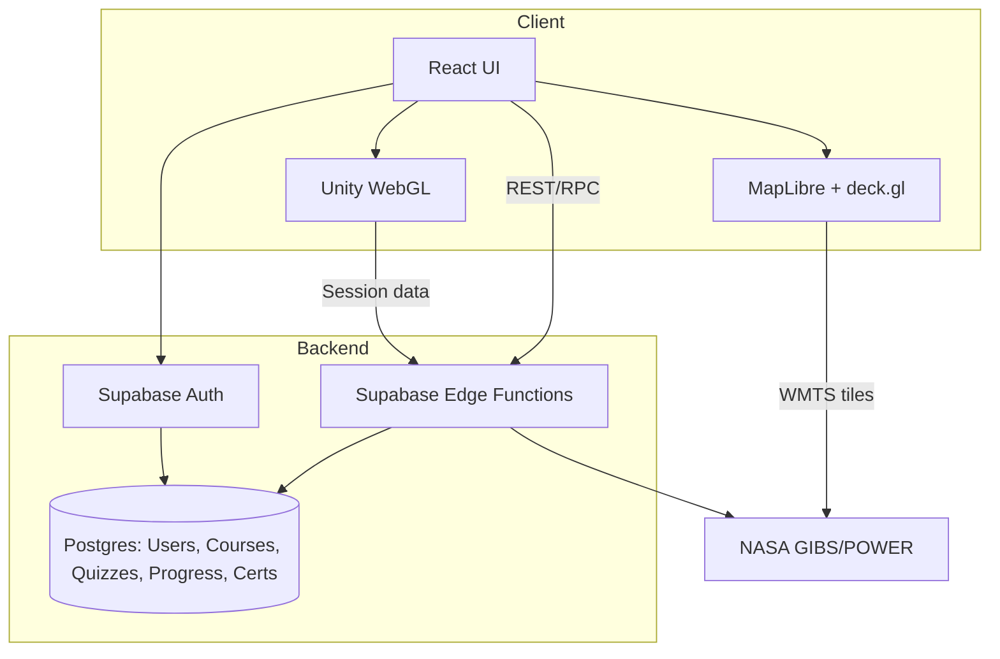
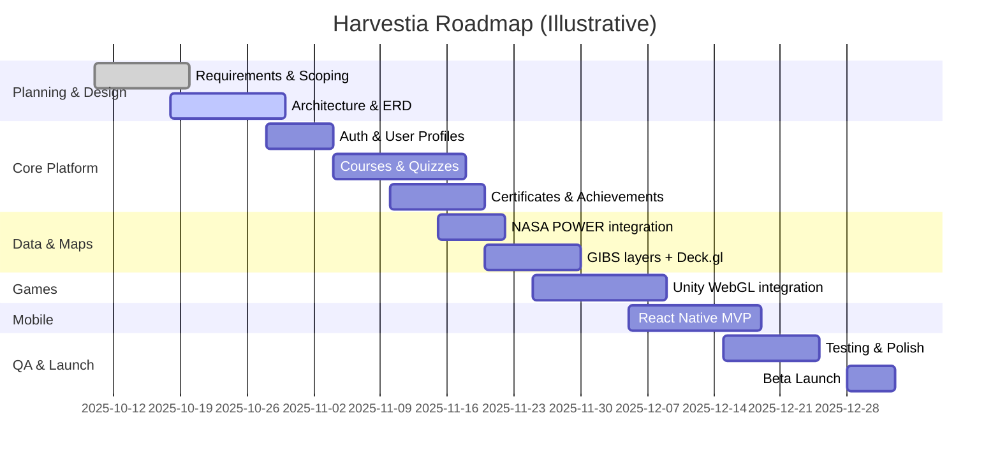
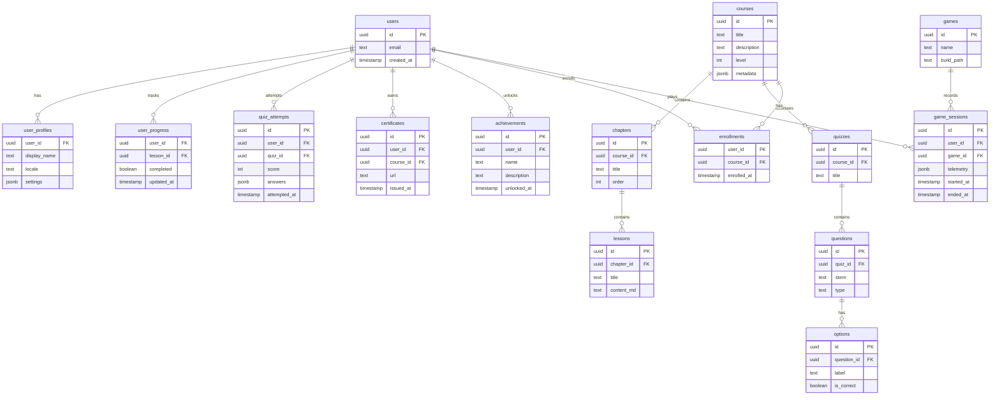

# Harvestia: Sustainable Farmer — Project Proposal

## Title

Harvestia: Sustainable Farmer — A gamified, data-driven learning platform for climate-smart agriculture

## Introduction

Smallholder farmers and agriculture students often struggle to access practical, localized, and engaging guidance on sustainable practices. Harvestia aims to bridge this gap with an interactive web and mobile platform that blends micro-courses, quizzes, and scenario-based simulations (Unity WebGL), enhanced with live geospatial insights from NASA GIBS/POWER and community-friendly tooling via Supabase. The goal is to enable learners to experiment, learn, and apply climate‑smart decisions with immediate feedback.

## Objectives

- Deliver a modern, mobile-friendly learning experience for sustainable agriculture.
- Integrate real geospatial data (NDVI, precipitation, soil moisture) to ground learning in current local conditions.
- Offer interactive simulations and mini‑games that reinforce decision-making skills.
- Provide assessment, progress tracking, achievements, and shareable certificates.
- Support educators with a modular course catalog and analytics.

## Problem Statement

Traditional agriculture education materials are static, generic, and lack local context. Learners rarely see the real-time impact of weather, water stress, or soil conditions on outcomes. Without engaging practice or timely feedback, knowledge retention and behavior change remain limited.

## Related Work

- MOOCs and LMS platforms (Coursera, Moodle) provide structured learning but lack live geospatial context and practical simulation.
- Farm advisory apps offer tips but often miss pedagogical structure and validated assessments.
- Research and tools using NASA Earth data (e.g., GIBS, POWER) demonstrate educational potential but are rarely integrated end‑to‑end with curricula, assessment, and gamification.

## Methodology

### 1) Technology Stack

- Web Frontend: React 18 + TypeScript, Vite, Tailwind CSS, shadcn/ui
- Mapping & Visualization: MapLibre GL JS, deck.gl, recharts
- Data Sources: NASA GIBS (WMTS tiles: NDVI, SMAP, GPM, ECOSTRESS), NASA POWER (weather/solar)
- Backend & Auth: Supabase (PostgreSQL, Auth, Edge Functions, Storage)
- Simulations/Games: Unity WebGL builds embedded via in‑app launcher
- Mobile App: Expo (React Native) + TypeScript
- Tooling: ESLint, Vitest, React Testing Library (planned), Prettier

### 2) Design Principles

- Accessibility first: color contrast, keyboard navigation, ARIA for UI controls
- Performance & DX: code-splitting, lazy load heavy maps/games, cache data with React Query
- Modularity: feature-driven folders, reusable hooks and UI components
- Data privacy: proxy external APIs via Edge Functions; secure RLS on user data
- Resilience: graceful degradation for NASA rate limits; fallbacks and toasts
- Internationalization: i18n scaffolding for future locales
- Mobile parity: shared pure logic for reuse between web and mobile

### 3) Core Components

- Map & Data
  - `AgricultureMap` (MapLibre + deck.gl NASA layers, opacity controls)
  - `NASADataVisualization`, `NASAPowerChart`, `SoilMoistureNow`, `WeatherNow`
  - Hooks: `useNASAData`, `useLocalWeather`
- Learning & Assessment
  - Pages: `Courses`, `CourseDetail`, `ChapterContent`
  - Hooks: `useCoursesCatalog`, `useQuizzesCatalog`, `useQuizExam`, `useUserProgress`
  - Certificates & Achievements: `useCertificates`, `useAchievements`
- Games & Simulation
  - `GameLauncher`, `UnityGame`, `UnityGameIntegration`, `GameManager`
- Shell & UI
  - `Layout`, `Header`, `AppSidebar`, `Footer`, `AuthDialog`, `AudioControls`, `CoachTips`, `StatsCard`

### System flow (high level)

```mermaid
flowchart LR
  A[Visitor] -->|Sign up / Login| B[Auth (Supabase)]
  B --> C[Dashboard]
  C --> D[Course Catalog]
  D --> E[Course Detail]
  E --> F[Chapters & Lessons]
  F --> G[Quizzes / Exams]
  G -->|Scores & Attempts| H[Certificates]
  C --> I[Agriculture Map]
  I --> J[NASA GIBS Layers]
  I --> K[NASA POWER API]
  C --> L[Game Launcher]
  L --> M[Unity WebGL Simulation]
  M -->|Telemetry| N[User Progress]
  N --> C
```

## Visuals

### 1) Flow Chart (detailed data pipeline)



### 2) Gantt Chart (illustrative timeline)



### 3) ERD (core tables)



### 4) UI Mockups (lo‑fi)

Dashboard

```
+-------------------------------------------------------------+
| Header: Logo | Nav: Courses | Map | Games | Profile         |
+----------------------+-------------------+------------------+
| Stats: Progress | Certificates | Achievements               |
+----------------------+-------------------+------------------+
| Quick Actions: Continue Course | Launch Simulation          |
+-------------------------------------------------------------+
```

Course Catalog

```
+---------------------------+  +---------------------------+
| Course Card               |  | Course Card               |
| Title  • Level • Tags     |  | Title  • Level • Tags     |
| [Start] [Details]         |  | [Start] [Details]         |
+---------------------------+  +---------------------------+
```

Course Detail

```
+---------------------+-------------------------------+
| Syllabus (chapters) | Lesson content / video        |
| 1. Intro            | [Take Quiz] [Mark Complete]   |
| 2. Soil Basics      |                               |
| 3. Water Mgmt       |                               |
+---------------------+-------------------------------+
```

Agriculture Map

```
+-------------------------------------------------------------+
| Map (MapLibre + deck.gl)                                     |
| [Toggle Layers: NDVI | Soil Moisture | Precipitation]       |
| [Select Location] [Opacity sliders]                         |
+-------------------------------------------------------------+
```

Game Launcher

```
+------------------------------+
| Simulation: Solar Storm      |
| [Launch] [How it Works]      |
+------------------------------+
| Simulation: Smart Farming    |
| [Launch] [How it Works]      |
+------------------------------+
```

Certificates

```
+--------------------------------------+
| Certificate Card                     |
| Course • Date • Share/Download       |
+--------------------------------------+
```

## Expected Results and Limitations

### Expected Results

- Increased engagement and completion rates via games and real data context.
- Improved knowledge retention measured by quiz performance and repeat attempts.
- Shareable certificates to motivate progression and showcase skills.

### Limitations

- NASA GIBS tiles can be rate‑limited; caching and graceful degradation required.
- Unity WebGL builds are heavy; initial load on low bandwidth devices may be slow.
- Offline support is partial; some features require connectivity.
- Geospatial data resolution varies by region; insights may be approximate.

## Conclusion

Harvestia combines pedagogy, play, and planetary data to make climate‑smart agriculture practical and engaging. By unifying courses, assessments, simulations, and live Earth data, the platform supports learners in practicing the decisions that matter for resilient, sustainable farming.

## References

- NASA GIBS: https://gibs.earthdata.nasa.gov/
- NASA POWER: https://power.larc.nasa.gov/
- MapLibre GL JS: https://maplibre.org/
- deck.gl: https://deck.gl/
- Supabase: https://supabase.com/
- Unity WebGL: https://docs.unity3d.com/Manual/webgl-gettingstarted.html
- Vite: https://vitejs.dev/
- Tailwind CSS: https://tailwindcss.com/
- Shadcn UI: https://ui.shadcn.com/

## Table of Work Progress

| No  | Date       | Objective                       | Status | Remarks |
| --- | ---------- | ------------------------------- | ------ | ------- |
| 1   | 2025-10-12 | Proposal and ERD finalized      | Done   |         |
| 2   | 2025-10-12 | Architecture & repo setup       | Done   |         |
| 3   | 2025-10-12 | Auth & user profiles            | Done   |         |
| 4   | 2025-10-12 | Courses & quizzes               | Done   |         |
| 5   | 2025-10-12 | Certificates & achievements     | Done   |         |
| 6   | 2025-10-12 | NASA POWER integration          | Done   |         |
| 7   | 2025-10-12 | GIBS layers & Agriculture Map   | Done   |         |
| 8   | 2025-10-12 | Unity WebGL integration         | Done   |         |
| 9   | 2025-10-12 | Mobile MVP (Expo)               | Done   |         |
| 10  | 2025-10-12 | QA pass & Beta launch readiness | Done   |         |
